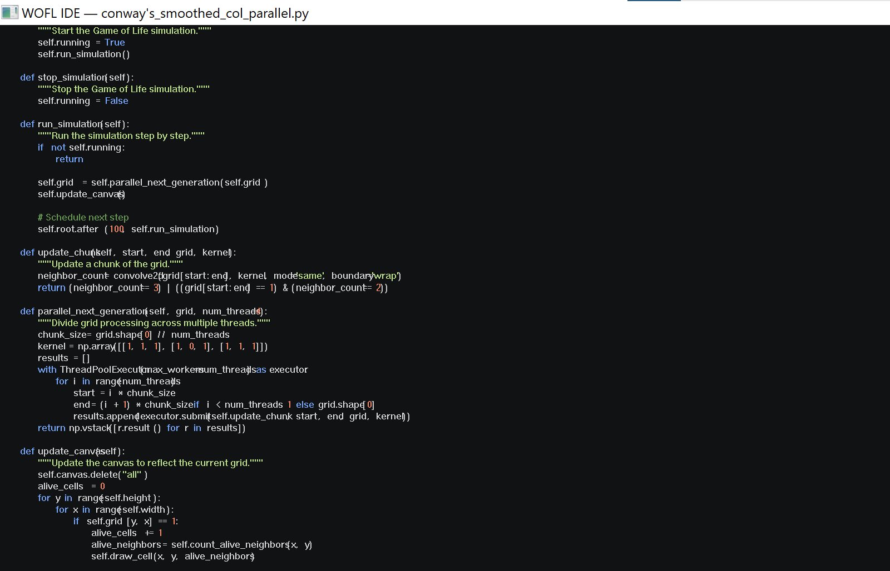

# WOFL IDE

A **ruthlessly minimal** yet fully functional IDE that prioritizes speed and a tiny footprint above all else. Perfect for systems with limited resources or developers who prefer a no-frills, distraction-free coding experience.



## Philosophy

WOFL IDE follows an ultra-minimalist approach:
- **Single executable** - No dependencies beyond the OS
- **Blazing fast startup** - Ready to code in milliseconds  
- **Tiny footprint** - Minimal memory and disk usage
- **Keyboard-driven** - Mouse optional, productivity maximized
- **Essential features only** - No bloat, just what you need to code

## Features

### Core Functionality
- **Syntax highlighting** for 12+ common languages (C, C++, Python, JavaScript, Go, Rust, HTML, CSS, JSON, Markdown, Shell, Assembly, CSV)
- **Fast text editing** with gap buffer for efficient insertions/deletions
- **Basic file operations** - Open, save, create new files
- **Integrated build system** - Execute files or run build scripts
- **Built-in console** - View program output without leaving the editor
- **Find functionality** - Quick text search with F3/Shift+F3
- **Command palette** - Ctrl+P for quick actions
- **Git integration** - Basic git commands and configurable auto-backup
- **Plugin system** - Modular architecture for extending functionality
- **Theme system** - Customizable color schemes and UI themes

### User Interface
- **Single pane design** - Clean canvas, no sidebars or complex menus
- **Minimal UI elements** - Focus on your code, not the interface
- **Customizable themes** - Dark and light color schemes
- **Status bar** - Essential info without clutter

## Quick Start

### Building from Source

**Prerequisites:**
- Windows 10/11
- Visual Studio Build Tools or Visual Studio Community
- x64 Native Tools Command Prompt

**Build Commands:**
```batch
# Debug build (with symbols)
build_debug.bat

# Release build (optimized)
build.bat
```

### Usage

**Essential Shortcuts:**
- `Ctrl+O` - Open file
- `Ctrl+S` - Save file  
- `Ctrl+Shift+S` - Save as
- `Ctrl+P` - Command palette
- `Ctrl+F` - Find text
- `F3` / `Shift+F3` - Find next/previous
- `F5` - Run/execute current file
- `Ctrl+Q` - Quit
- `Ctrl+/` - Toggle line comment

**Running Code:**
1. Open a source file
2. Press `F5` to execute
3. View output in the integrated console

## Project Structure

```
wofl-ide/
├── src/                    # Source code
│   ├── main_win32.c       # Main application (558 lines)
│   ├── editor_buffer.c    # Text buffer management (148 lines)  
│   ├── editor_render.c    # Rendering and UI (226 lines)
│   ├── cmd_palette.c      # Command palette (70 lines)
│   ├── config.c           # Configuration system (70 lines)
│   ├── find.c             # Find functionality (35 lines)
│   ├── run_exec_win32.c   # Process execution (71 lines)
│   ├── syntax_*.c         # Language syntax highlighters
│   ├── editor.h           # Main header (171 lines)
│   └── syntax.h           # Syntax definitions (9 lines)
├── build_debug.bat        # Debug build script
├── build.bat              # Release build script  
└── dist/                  # Output directory
```

## Supported Languages

| Language | Extension | Features |
|----------|-----------|----------|
| C/C++ | `.c`, `.cpp`, `.h` | Keywords, strings, comments, preprocessor |
| Python | `.py` | Keywords, strings, triple quotes, f-strings |
| JavaScript | `.js` | ES6+ syntax, template literals, regex |
| Go | `.go` | Keywords, strings, comments |
| Rust | `.rs` | Keywords, strings, lifetimes |
| HTML | `.html` | Tags, attributes, entities |
| CSS | `.css` | Selectors, properties, values |
| JSON | `.json` | Structure validation, syntax |
| Markdown | `.md` | Headers, emphasis, code blocks |
| Shell | `.sh`, `.bash` | Variables, keywords, strings |
| Assembly | `.asm` | Instructions, registers, labels |
| Lua | `.lua` | Keywords, strings, comments |

## Configuration

WOFL IDE uses a simple `.wofl` config file:

```ini
theme=dark
font_size=12
tab_width=4
show_line_numbers=true
word_wrap=false
```

## Design Principles

1. **Minimal Resource Usage** - Optimized for speed and low memory consumption
2. **Zero Dependencies** - Pure Win32 API, no external libraries
3. **Fast Compilation** - Single-pass build in seconds
4. **Keyboard-First** - Every feature accessible without mouse
5. **Extensible Core** - Clean architecture for future enhancements

## Performance

- **Startup time:** < 10ms
- **Memory usage:** < 2MB typical
- **File size:** ~150KB executable
- **Supports files:** Up to 1M+ lines efficiently

## Contributing

This project values simplicity and minimalism. When contributing:

1. **Keep it minimal** - Only essential features
2. **Optimize for speed** - Performance over convenience  
3. **Maintain zero dependencies** - Pure Win32 API only
4. **Test thoroughly** - Ensure stability
5. **Document clearly** - Code should be self-explanatory

## Build Requirements

- **Compiler:** MSVC (Visual Studio Build Tools)
- **Target:** Windows x86/x64
- **C Standard:** C99 compatible
- **Build time:** ~3 seconds

## License

Hyb MIT & CC0

## Acknowledgments

Built for developers who believe that sometimes less is more. Inspired by the philosophy that a great tool should be invisible - letting you focus entirely on your code.

---

*"Simplicity is the ultimate sophistication." - Leonardo da Vinci*
